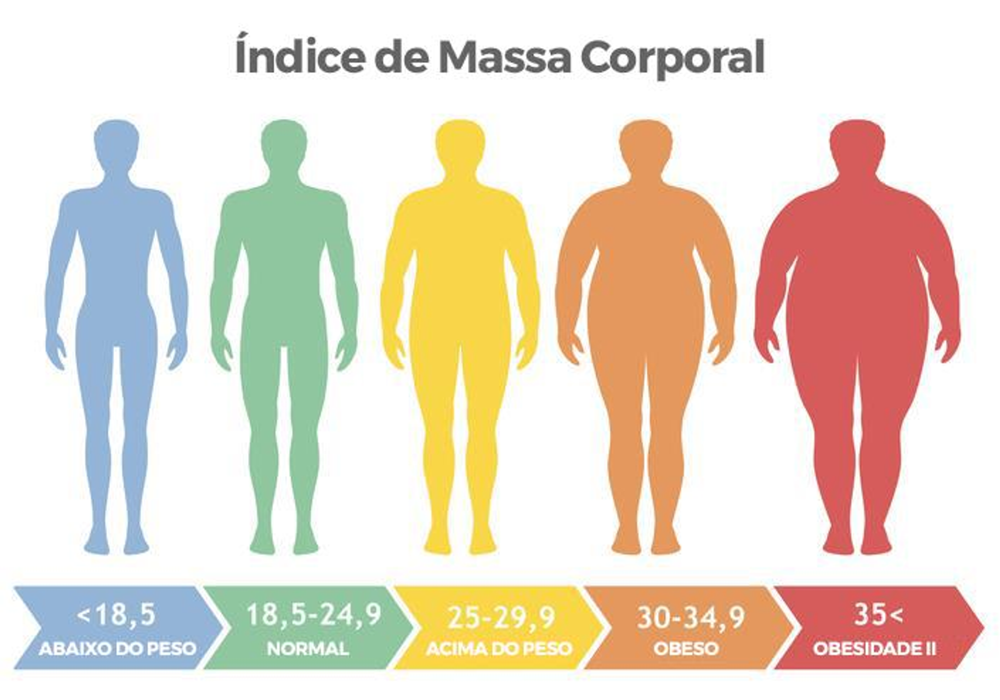
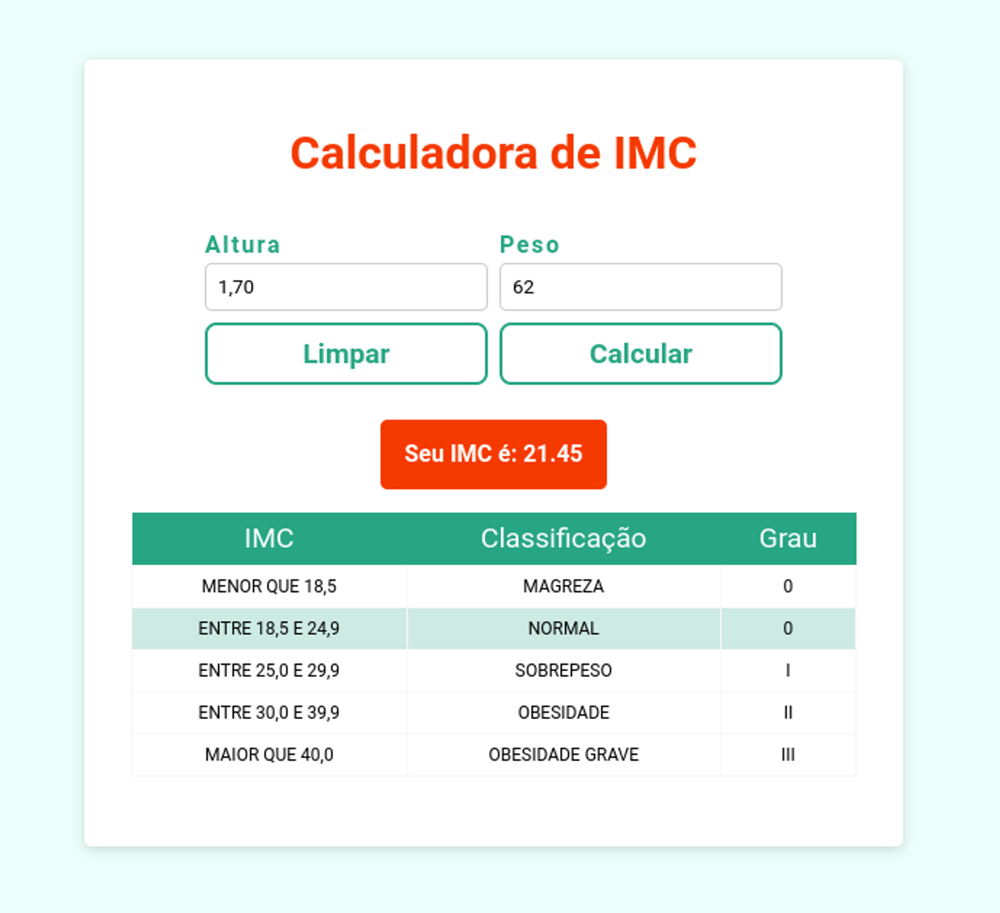

## Descrição

O Índice de Massa Corporal (**IMC**) é, na verdade, uma referência. Ao fazer o cálculo, é possível identificar se o seu peso está acima ou abaixo do indicado.

Para fazer essa calculadora, é necessário entender a formula desse calculo:

## Requisitos do projeto

- Criar um projeto React com o template padrão do React
- Criar ao menos um componente para a calculadora
- Utilizar useState para manipulação de estado na aplicação
- Crie dois inputs, um para altura  e outro para o peso
- Aceite valores com vírgula e converta na hora de calcular o IMC
- Crie um botão para limpar os dados do input e o resultado do IMC
- Crie um botão para calcular o IMC
- Mostre o valor convertido em tela de acordo com o calculo apenas se ele for maior que zero.
- Crie uma tabela de referencia com os intervalos de IMC a classificação e o Grau
- Assim que o IMC for calculado mude o backgourd-color da TR da tabela que corresponde ao valor do IMC

## Exemplo de layout

Bom trabalho!